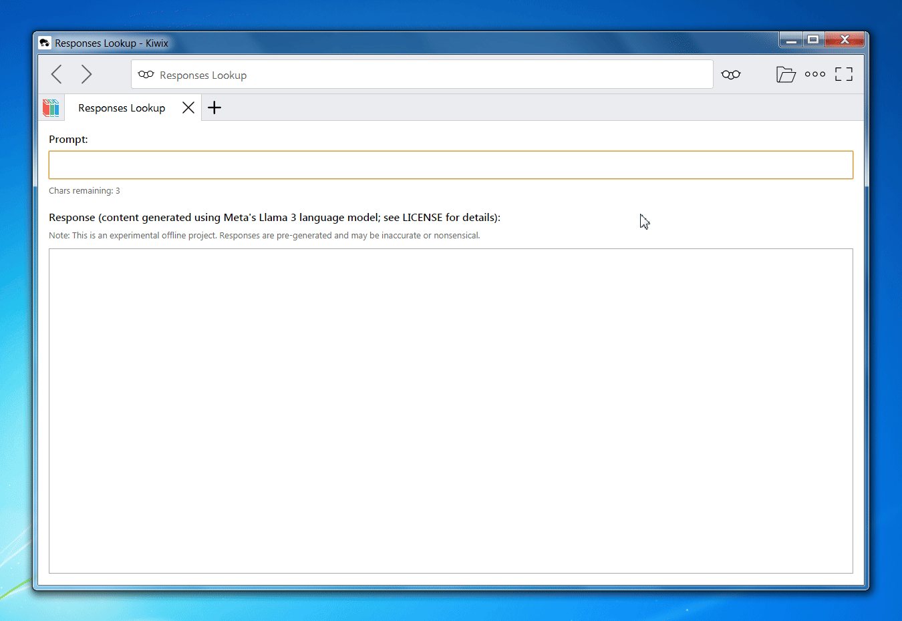
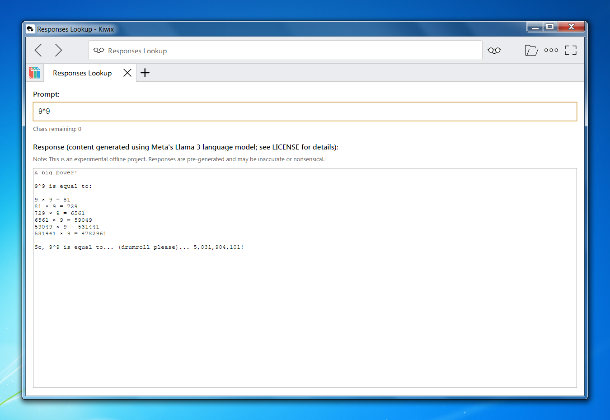
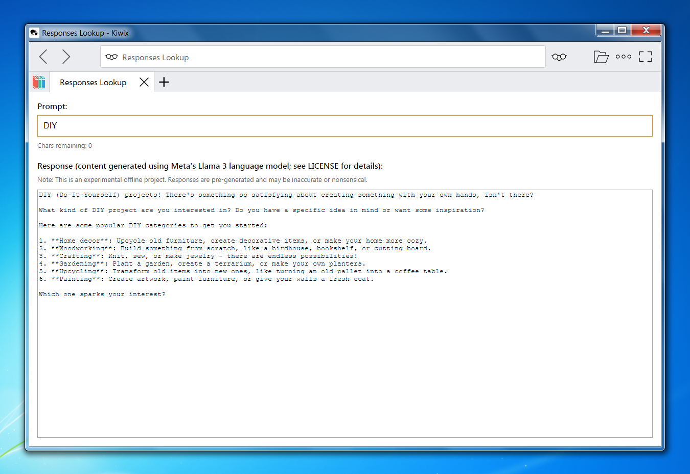
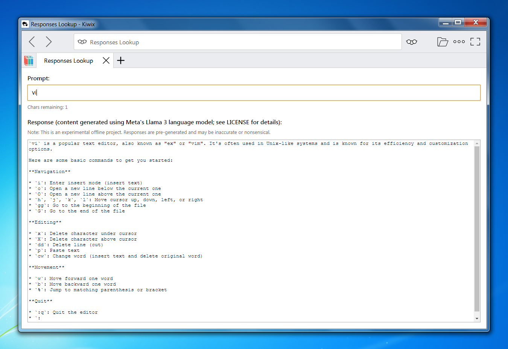

# AI Response Archive

Canonical documentation for the AI Response Archive project.

AI Response Archive is an experimental offline collection of pre-generated AI responses, distributed as a self-contained ZIM file for use with Kiwix.

Instead of performing live inference, the project systematically enumerates a bounded prompt space and preserves the resulting responses as a static, offline artifact.

The distributed archive is available via Gumroad:

https://anthonykaram.gumroad.com/l/ai_response_archive

---

## Overview

The archive captures all prompt strings composed of printable ASCII characters up to a maximum length **N**.

Let:

- `A` = number of printable ASCII characters  
- `N` = maximum prompt length  

The total enumerated prompt space is:

A¹ + A² + A³ + ... + Aⁿ

Each prompt is evaluated once using a fixed model configuration, and the resulting output is preserved verbatim.

The archive is therefore:

- Deterministic  
- Fully enumerated within its defined bounds  
- Static (no runtime inference)  
- Offline-first  

Because the prompt space grows exponentially with respect to `N`, each increment substantially increases generation time and storage requirements.

---

## How It Works

The distributed ZIM file contains:

- A lightweight HTML + JavaScript interface  
- A static corpus of pre-generated prompt-response pairs  
- A lookup mechanism that maps prompts to their stored responses  

At runtime:

1. The user enters a prompt (up to length `N`)
2. The interface performs a deterministic local lookup
3. The corresponding pre-generated response is displayed instantly

No network requests are made.  
No APIs are contacted.  
No model inference occurs.

---

## Demonstration

### Interface in Operation

---

### Example Outputs

---

## Design Principles

- **Offline-first** — Fully functional without internet connectivity  
- **Bounded enumeration** — Entire prompt space covered within defined limits  
- **Static distribution** — No dynamic generation  
- **Self-contained artifact** — Packaged as a single ZIM file  
- **Combinatorial transparency** — Growth characteristics are explicit and mathematical  

---

## Computational Characteristics

Let:

- `A` = printable ASCII alphabet size  
- `N` = maximum prompt length  

Total prompts:

A¹ + A² + ... + Aⁿ

This geometric expansion defines the core scaling behavior of the archive.

Increasing `N` by 1 multiplies the largest term by `A`, resulting in substantial increases in storage size and generation workload.

This combinatorial structure is intentional and foundational to the experiment.

---

## Repository Scope

This repository serves as the canonical documentation and reference page for the AI Response Archive project.

It does not contain:

- The distributed ZIM file  
- Generation scripts  
- Model weights  
- Reproducible inference pipelines  

The archive itself is distributed commercially via Gumroad.

---

## Intended Use Cases

- Offline environments  
- Digital preservation  
- AI behavior study over bounded domains  
- Archival experimentation  
- Resilience-focused computing  

---

## Distribution Format

- Format: ZIM  
- Compatible with: Kiwix (Desktop & Mobile)  
- Fully functional without internet access  

---

## Status

The project is experimental and evolving.

Future releases may increase the maximum prompt length `N`, subject to practical constraints such as storage growth and distribution feasibility.

---

© 2026 Anthony Karam. All rights reserved.